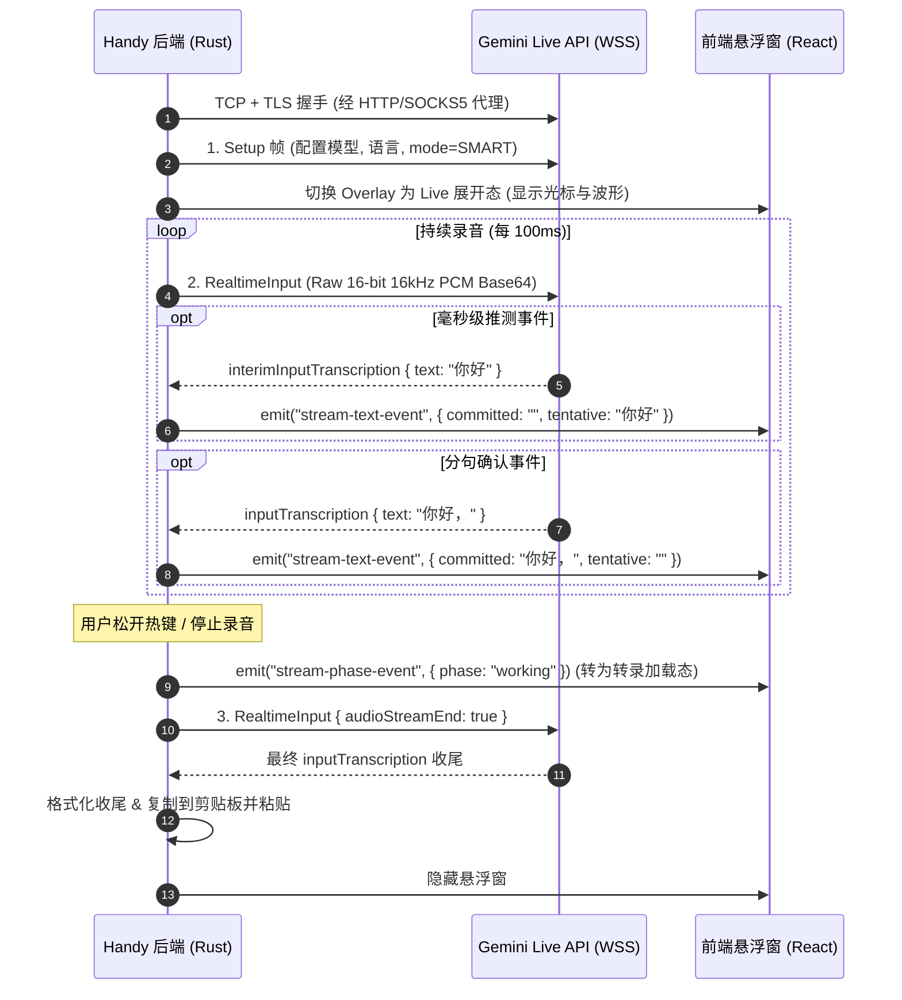

# Google Gemini Transcribe Live 实时流式转写调研报告与 Handy 实现方案

- **调研日期**：2026-09-05
- **调研目标**：
  1. 深入调研 Google 官方最新推出的 `gemini-3.5-transcribe-live` (Gemini Live API) 双向 WebSocket 协议细节与报文契约；
  2. 深度反编译/审查 Handy 现有本地实时转写模型（Nemotron Streaming / Voxtral Realtime / Parakeet）的流式架构设计；
  3. 论证如何无缝打通 Handy 现有的流式音频路由、两级字幕悬浮窗与 Gemini Live API，给出优雅、低侵入且高可靠的端到端实现方案。
- **一手事实来源**：
  - [Google AI for Developers - Live transcription with Gemini Live API](https://ai.google.dev/gemini-api/docs/live-api/live-transcribe)
  - [Google AI for Developers - Gemini Live API Reference](https://ai.google.dev/api/live-api)
  - [Google Cloud Documentation - Gemini 3.5 Transcribe](https://docs.cloud.google.com/gemini-enterprise-agent-platform/models/gemini/3-5-transcribe)
  - Handy 源码：`src-tauri/src/actions.rs`、`src-tauri/src/managers/transcription.rs`、`src-tauri/src/audio_toolkit/audio/recorder.rs`、`src-tauri/src/overlay.rs`、`src/overlay/RecordingOverlay.tsx`

---

## 一、结论摘要（Executive Summary）

1. **协议契约高度吻合，前端 UI 可 100% 零改动复用**：
   - Handy 前端悬浮窗（`RecordingOverlay.tsx`）原生支持**两级流式文字渲染**：
     - `committed`：已权威确认的追加前缀（白字保持不变，防抖动）；
     - `tentative`：实时推测中的暂态后缀（斜体/淡色动态重写，带有跳动光标）。
   - Google `gemini-3.5-transcribe-live` WebSocket 服务端事件**恰好完美对应这一概念**：
     - `serverContent.inputTranscription.text` $\equiv$ `committed`（权威分句/停顿确认文本）；
     - `serverContent.interimInputTranscription.text` $\equiv$ `tentative`（毫秒级推测片段）。
   - 因此，**前端 UI、Tauri 事件定义（`StreamTextEvent`）与悬浮窗动画完全无需任何修改**，仅需在 Rust 后端接入即可获得原生实时字出效果。

2. **Handy 现存流式通道的设计模式**：
   - Handy 拥有完整的音频旁路流机制：`AudioRecorder` 通过 `StreamRouter`，在录音进行时直接把采集到的 16kHz 单声道采样推送给流式 Worker；
   - 现存瓶颈在于：`actions.rs` 与 `TranscriptionManager` 强绑定了本地 C++ 模型（`LoadedEngine::TranscribeCpp`），在 `TranscriptionMode::Cloud` 下跳过了流式判断。

3. **落地方案核心设计**：
   - 抽离 `StreamingTranscriptionProvider` 与 `StreamingSession` Trait，将流式能力提升至 `TranscriptionRouter`；
   - 引入 `tokio-tungstenite` 结合现有的 `NetworkManager` 代理通道（支持 HTTP CONNECT 与 SOCKS5 握手），建立长连接；
   - 16kHz `f32` 音频按 100ms（1600 采样）切片转换为标准 16-bit PCM Base64 持续推流；
   - 按键松开（录音结束）时向服务端发送 `audioStreamEnd: true`，优雅等待最后分句并完成自动粘贴。

---

## 二、Google Gemini Live API (`gemini-3.5-transcribe-live`) 一手技术规范

### 1. 核心架构与端点

- **协议**：全双工 WebSocket（WSS）
- **官方端点**：
  `wss://generativelanguage.googleapis.com/ws/google.ai.generativelanguage.v1beta.GenerativeService.BidiGenerateContent?key={API_KEY}`
- **模型名称**：`models/gemini-3.5-transcribe-live`
- **单会话最大时长**：10 分钟（完全满足桌面短语音输入场景）

### 2. 交互生命周期与报文格式



#### (1) 连接握手建立后的首帧（Setup Message）

连接一经建立，客户端必须立即发送初始化握手报文：

```json
{
  "setup": {
    "model": "models/gemini-3.5-transcribe-live",
    "generationConfig": {
      "responseModalities": ["TEXT"]
    },
    "inputAudioTranscription": {
      "languageCodes": [],
      "mode": "SMART",
      "customVocabulary": ["Handy", "Tauri", "Rust"]
    }
  }
}
```

- `responseModalities`: 固定设为 `["TEXT"]`，告知服务端这是一个纯语音识别流，不调用大模型生成语音回复；
- `languageCodes`: `[]` 开启自动语种识别（支持 85+ 语言与混合说话），或填入用户在 Handy 设置的单语言（如 `["zh-CN"]`）；
- `mode`: `"SMART"` 启用智能去语气词（移除 “嗯/啊/这个”）、自动修正口误、标点及数字符号规范化；
- `customVocabulary`: 可直接把 Handy 设置中的自定义热词列表传入（最高支持 1,000 个词汇）。

#### (2) 实时推流帧（Realtime Audio Input）

- **采样规范**：Raw 16-bit Mono 16kHz PCM（Little-Endian）；
- **发送频率**：推荐每 100ms 发送一次（即 1600 个采样点 = 3200 字节二进制 PCM）；
- **报文格式**：

```json
{
  "realtimeInput": {
    "audio": {
      "data": "<BASE64_ENCODED_PCM_DATA>",
      "mimeType": "audio/pcm;rate=16000"
    }
  }
}
```

#### (3) 录音终止帧（Audio Stream End）

当用户松开快捷键时，客户端无需强行中断 WebSocket，只需发送一个结束信号，触发服务端完成最终分句与字词收尾：

```json
{
  "realtimeInput": {
    "audioStreamEnd": true
  }
}
```

#### (4) 服务端下行推流事件（Server Content Events）

```json
{
  "serverContent": {
    "interimInputTranscription": {
      "text": "今天天气真好"
    },
    "inputTranscription": {
      "text": "今天天气真好，"
    }
  }
}
```

---

## 三、Handy 现存本地实时转写架构剖析

通过阅读 Handy 现有针对 `nemotron-3.5-asr-streaming-0.6b` 和 `parakeet` 的实现，其流式转写体系已经具备了成熟的分层架构：

### 1. 音频旁路流通道（`StreamRouter`）

- 位于 `src-tauri/src/managers/transcription.rs`：
  - `StreamRouter` 持有一个 `Mutex<Option<mpsc::Sender<StreamCmd>>>` 和原子标记 `open: Arc<AtomicBool>`；
  - `AudioRecorder`（`src-tauri/src/audio_toolkit/audio/recorder.rs`）在录音回调中直接持有 `StreamRouter` 的 `Arc` 引用：
    ```rust
    .with_audio_callback({
        let router = stream_router;
        move |frame| {
            router.feed(frame);
        }
    })
    ```
  - 当流未开启时，`router.feed(frame)` 仅执行一次极低开销的原子读取（Relaxed Atomic Load），完全无锁零消耗；
  - 当流开启时，每一帧 16kHz `&[f32]` 音频被即时推入 `StreamCmd::Feed(Vec<f32>)` 队列。

### 2. 流生命周期控制（`start_stream` / `finalize_stream` / `cancel_stream`）

- **启动流（`start_stream`）**：
  在 `actions.rs` 捕获到按键按下（`start`）时触发：
  - 打开 `StreamRouter`，重置流状态；
  - 若模型支持流式且设置中开启了 `OverlayStyle::Live`，直接调用 `utils::show_streaming_overlay(app)` 将悬浮窗展开为打字机宽面板；
  - 后台 Worker 线程启动循环拉取 `StreamCmd::Feed`。
- **结束流（`finalize_stream`）**：
  在按键松开（`stop`）时触发：
  - 向 Worker 发送 `StreamCmd::Finalize(reply_tx)`；
  - Worker 冲刷缓冲区，返回最终完整文本 `FinalizedStreamText`；
  - 触发后处理并返回 `Ok(Some(text))`，`actions.rs` 拿到该文本后**直接跳过离线整段重转**，零延迟粘贴。
- **取消流（`cancel_stream`）**：
  用户按下取消快捷键或录音为空时，清空通道并重置状态。

### 3. 前端实时悬浮窗契约（`StreamTextEvent`）

- 后端通过 `app.emit("stream-text-event", StreamTextEvent { committed, tentative })` 广播事件；
- 前端 `src/overlay/RecordingOverlay.tsx` 直接绑定：
  ```tsx
  <div className="stext-cap">
    <p>
      <span className="committed">
        {streamText.committed ? streamText.committed + " " : ""}
      </span>
      <span className="tentative">{streamText.tentative}</span>
      {!working && <span className="scaret" />}
    </p>
  </div>
  ```
  `committed` 与 `tentative` 在视觉上天衣无缝地拼接在一起，带有平滑滚动与光标闪烁。

---

## 四、Gemini Live 实时流式转写落地方案设计

### 1. 架构关键：统一流式提供者契约（Streaming Provider Trait）

在 `src-tauri/src/providers/` 中定义流式抽象接口，与现有 `BatchTranscriptionProvider` 形成对称架构：

```rust
#[async_trait::async_trait]
pub trait StreamingTranscriptionProvider: Send + Sync {
    /// 检查当前配置或模型是否支持流式实时转写
    fn supports_streaming(&self, model: &str) -> bool;

    /// 开启流式转写会话
    async fn start_stream(
        &self,
        options: &TranscriptionOptions,
        text_sink: Arc<dyn StreamTextSink>,
    ) -> Result<Box<dyn StreamingSession>, String>;
}

pub trait StreamTextSink: Send + Sync {
    /// 发送流式文本更新（committed 稳定前缀，tentative 推测后缀）
    fn emit_text(&self, committed: String, tentative: String);
}

#[async_trait::async_trait]
pub trait StreamingSession: Send + Sync {
    /// 持续喂入 16kHz 单声道 f32 采样
    fn feed_audio(&mut self, samples: &[f32]) -> Result<(), String>;

    /// 停止录音，冲刷缓冲区并等待最终文本输出
    async fn finalize(self: Box<Self>) -> Result<String, String>;

    /// 放弃转写并清理长连接
    async fn cancel(self: Box<Self>);
}
```

### 2. 网络代理与 WebSocket 穿透实现

国内与企业网络访问 `generativelanguage.googleapis.com` 必须通过代理。针对 `tokio-tungstenite` 缺乏原生代理支持的问题，通过以下方案实现穿透：

```rust
// 伪代码架构：WebSocket 连接握手与代理穿透
pub async fn connect_gemini_websocket(
    url: &url::Url,
    proxy_config: Option<&ProxySettings>,
) -> Result<WebSocketStream<MaybeTlsStream<TcpStream>>, String> {
    let host = url.host_str().ok_or("Missing host")?;
    let port = url.port_or_known_default().unwrap_or(443);

    let tcp_stream = match proxy_config {
        Some(ProxySettings::Http(proxy_addr)) => {
            // 1. 发送 HTTP CONNECT 隧道指令
            let mut stream = TcpStream::connect(proxy_addr).await?;
            let connect_req = format!(
                "CONNECT {}:{} HTTP/1.1\r\nHost: {}:{}\r\nProxy-Connection: Keep-Alive\r\n\r\n",
                host, port, host, port
            );
            stream.write_all(connect_req.as_bytes()).await?;
            // 读取 HTTP 200 Connection Established 响应
            verify_http_connect_response(&mut stream).await?;
            stream
        }
        Some(ProxySettings::Socks5(proxy_addr)) => {
            // 2. 通过 SOCKS5 握手连接
            tokio_socks::tcp::Socks5Stream::connect(proxy_addr, (host, port)).await?
        }
        None => TcpStream::connect((host, port)).await?,
    };

    // 3. TLS 封装与 WebSocket 客户端握手
    let connector = tokio_native_tls::TlsConnector::from(native_tls::TlsConnector::new()?);
    let tls_stream = connector.connect(host, tcp_stream).await?;
    let (ws_stream, _) = tokio_tungstenite::client_async_tls(url.as_str(), tls_stream).await?;

    Ok(ws_stream)
}
```

### 3. 音频流式分块缓冲与 PCM 编码（Audio Buffer Chunking）

- Handy 的 `AudioRecorder` 回调交付的切片粒度约为数十毫秒（通常为 512 或 1024 个采样点，`f32` 格式，范围 $[-1.0, 1.0]$）；
- Google Live API 推荐以 **100ms** 为周期发送（16kHz 下为 1600 个采样）；
- 在 `GeminiStreamingSession` 内部维护一个轻量 `Vec<i16>` 采样缓冲区：
  1. 采样转换：`let pcm_sample = (sample.clamp(-1.0, 1.0) * 32767.0) as i16;`
  2. 累积达到 1600 采样（100ms）后，将小端序字节数组 Base64 编码，构造 `realtimeInput` 帧写入 WebSocket；
  3. 清空缓冲区，等待下一批采样。

### 4. 文本事件状态机（State Machine）

在接收 WebSocket 下行帧的后台协程中，维护两个文本缓冲区：

- `committed_text: String`：保存历次 `inputTranscription` 确认文本的拼接结果；
- 当收到 `interimInputTranscription { text }` 时：
  - 调用 `text_sink.emit_text(committed_text.clone(), text)`；
- 当收到 `inputTranscription { text }` 时：
  - `committed_text.push_str(&text);`
  - 调用 `text_sink.emit_text(committed_text.clone(), String::new())`（清空暂态推测）；
- 当收到 `audioStreamEnd` 响应并触发 `finalize` 时：
  - 返回完整的 `committed_text`，作为转写最终结果。

---

## 五、边界条件与容灾策略

1. **网络抖动与 WebSocket 断连自动降级（Fallback to Batch）**：
   - 若流式连接在录音过程中异常断开或报错，`finalize()` 返回 `Err` 或 `Ok(None)`；
   - `actions.rs` 中现存的 Fallback 机制会**无缝触发**：
     由于本地始终完整保留录音生成的 WAV 样本（`samples: Vec<f32>`），一旦流式未能交付有效文本，系统将立即退回到现有的 `router.transcribe(samples)` 进行常规批处理识别，用户不会丢失任何语音。
2. **VAD 静音截断控制**：
   - 开启流式时，将端侧 VAD 策略调整为 `VadPolicy::Streaming`（延长后置静音等待尾长）；
   - 用户松开按键时发送 `audioStreamEnd: true`，利用 Google 服务端快速裁决结束，兼顾输入流畅性与即时响应。
3. **模型选择互斥与显式标示**：
   - 在前端云端模型列表中，将 `gemini-3.5-transcribe` 标为“批处理（高精度）”，将 `gemini-3.5-transcribe-live` 标为“实时流式（极速打字）”；
   - 切换至 Live 模型时，自动启用悬浮窗的实时预览模式。

---

## 六、实施落地路线清单

| 阶段          | 模块               | 实施任务                                                                                                                                                   |
| ------------- | ------------------ | ---------------------------------------------------------------------------------------------------------------------------------------------------------- |
| **Phase 2.1** | **依赖与底层协议** | 1. 引入 `tokio-tungstenite` 与 WebSocket 代理握手辅助函数；<br>2. 封装 `GeminiLiveClient`，打通鉴权、Setup 与 Ping/Pong 链路。                             |
| **Phase 2.2** | **转写路由解耦**   | 1. 定义 `StreamingTranscriptionProvider` 与 `StreamingSession` Trait；<br>2. 在 `TranscriptionRouter` 中添加流式统一调度入口，打通本地与云端模型能力检测。 |
| **Phase 2.3** | **录音动作流接入** | 1. 改造 `actions.rs`，在云端模式选择 `gemini-3.5-transcribe-live` 时开启流式生命周期；<br>2. 桥接 `StreamRouter` 的 PCM 数据至 `StreamingSession`。        |
| **Phase 2.4** | **配置与 UI 适配** | 1. 在模型选项中增加 `gemini-3.5-transcribe-live`；<br>2. 验证流式打字、自动粘贴与网络异常自动回退批处理的端到端体验。                                      |
