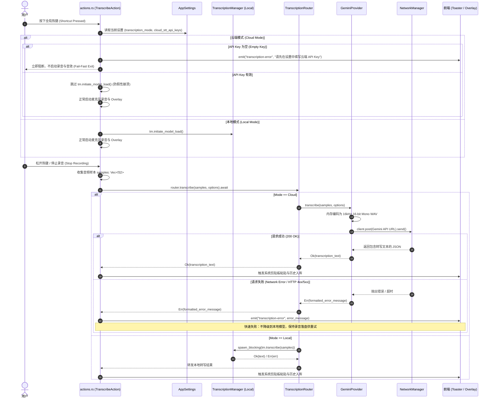
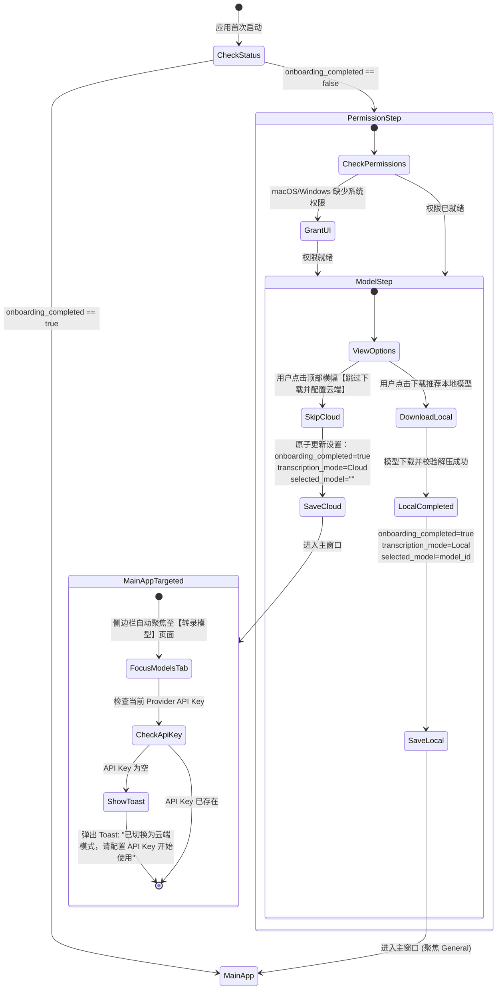

# Handy-Cloud 第一阶段实施规格说明书
# Phase 1 Implementation Specification: Batch Cloud STT & Global Proxy

**文件版本**：1.0.0  
**状态**：APPROVED / READY FOR IMPLEMENTATION  
**关联工单**：#10（终点交付），所属地图 #4  
**决策依据**：ADR-0001、ADR-0002、ADR-0003、ADR-0004  
**适用阶段**：Phase 1（批处理云端 STT、全局代理基础设施、开屏引导解耦与系统托盘联动）

---

## 1. 架构总览与核心设计原则

Handy-Cloud 是基于桌面语音输入工具 Handy（Tauri 2.x + Rust + React/TypeScript）构建的云端强化版本。其核心目标是在保持对上游 `cjpais/Handy` 纯离线推理体系零破坏的前提下，为应用注入高质量的云端大模型语音识别能力（以 Google Gemini 2.5 Flash 为基准），并建立全局网络代理基础设施与友好的免本地模型冷启动体验。

```
                  ┌─────────────────────────────────────────────────────────────┐
                  │                      前端 React UI                          │
                  │  (Settings / Onboarding / Overlay / Status Pills / Toaster) │
                  └──────────────┬───────────────────────────────▲──────────────┘
                                 │ Tauri Commands                │ Events
                                 ▼                               │
┌────────────────────────────────────────────────────────────────┴──────────────┐
│                              Tauri Rust Backend                               │
│                                                                               │
│  ┌──────────────────────┐        ┌─────────────────────────────────────────┐  │
│  │   NetworkManager     │        │            TrayManager                  │  │
│  │  (System Proxy /     │        │  (☁️ Cloud & ● Local Unified Submenu)    │  │
│  │   reqwest Client)    │        └─────────────────────────────────────────┘  │
│  └──────────┬───────────┘                                                     │
│             │ HTTP Connection Pool                                            │
│             ▼                                                                 │
│  ┌─────────────────────────────────────────────────────────────────────────┐  │
│  │                   actions.rs (TranscribeAction)                         │  │
│  │    [Guard 1] Pre-recording empty API Key Fail-Fast                      │  │
│  │    [Guard 2] Skip local model initiate_model_load for Cloud mode        │  │
│  └──────────────────────────────────────┬──────────────────────────────────┘  │
│                                         │ samples: Vec<f32>                   │
│                                         ▼                                     │
│  ┌─────────────────────────────────────────────────────────────────────────┐  │
│  │                 TranscriptionRouter (Facade 分流门面)                    │  │
│  │                     match settings.transcription_mode                   │  │
│  └───────────────────┬─────────────────────────────────┬───────────────────┘  │
│                      │                                 │                      │
│      [Mode == Cloud] │                 [Mode == Local] │                      │
│                      ▼                                 ▼                      │
│  ┌──────────────────────────────────────┐  ┌───────────────────────────────┐  │
│  │         GeminiProvider               │  │   LocalTranscriptionProvider  │  │
│  │  - Hound In-Memory WAV Encoding      │  │   - Thin wrapper                  │  │
│  │  - REST POST via NetworkManager      │  │   - Forward to TranscriptionMgr   │  │
│  │  - Fail-Fast Error Propagation       │  │   - Retain Whisper/Parakeet Core  │  │
│  └──────────────────┬───────────────────┘  └───────────────┬───────────────┘  │
│                     │                                      │                  │
└─────────────────────┼──────────────────────────────────────┼──────────────────┘
                      ▼                                      ▼
           Google Gemini REST API                   Local CPU/GPU Inference
        (generativelanguage.googleapis.com)       (transcribe-cpp / transcribe-rs)
```

### 1.1 核心设计不变量（Architecture Invariants）

1. **包住 Handy，而非拆掉 Handy（Wrap, Don't Rip）**：
   Handy 现有的 2500+ 行 `transcription.rs`、模型加载卸载生命周期、VAD 过滤、实时音频流处理与推理底层保持完好，不引入侵入性重写。本地模型推理能力被视为系统的一种标准 `Provider`。
2. **极薄侵入原则（Thin Surface Hooking）**：
   针对现有核心文件的修改仅限于必要的生命周期挂载点：
   - `actions.rs`：前置空凭据守卫、云端模式跳过 `initiate_model_load`、出字点分流调用；
   - `commands/history.rs`：历史记录重试转写点分流调用；
   - `tray.rs`：托盘模型子菜单置顶云端选项与同层互斥联动；
   - `Onboarding.tsx`：列表顶部追加云端优先免下载横幅；
   - 其余新增能力（网络管理、服务商实现、路由分流等）全部作为独立模块新增。
3. **网络层下沉为全局基础设施（Network as Infrastructure）**：
   代理配置独立于 STT 业务逻辑，由全局单例 `NetworkManager` 统一管理，支持免重启热重载，并供给后续的 LLM 后处理、自动更新等全量网络模块共用。
4. **云端与本地严格分离（No Pseudo-Models）**：
   云端 API 不伪装为本地 GGUF/ONNX 模型文件，不污染本地模型列表。本地已配置的模型选择与云端模型配置并行持久化，切换引擎时不丢失另一方的配置。
5. **快速失败与确定性预期（Fail-Fast）**：
   云端转写遇网络超时或凭据错误时立即报错，杜绝静默回退至本地模型造成数秒冷启动卡顿；录音前检测到空 API Key 即刻阻断，避免浪费用户发音。

---

## 2. 系统架构与时序图

### 2.1 录音与转写分流时序图（Audio & Transcription Flow）



### 2.2 开屏引导跳过与落地接管流转（Onboarding Decoupling Flow）



---

## 3. Rust 后端规范说明（Backend Specification）

### 3.1 配置层定义（`src-tauri/src/settings.rs`）

在现有 `AppSettings` 中新增网络代理与云端 STT 所需的核心数据结构，全部实现 `Serialize, Deserialize, Debug, Clone, Type` 保证 specta 自动生成前端 bindings：

```rust
// ---------------------------------------------------------------------------
// 代理相关数据结构
// ---------------------------------------------------------------------------

#[derive(Serialize, Deserialize, Debug, Clone, Copy, PartialEq, Eq, Type)]
#[serde(rename_all = "snake_case")]
pub enum ProxyMode {
    /// 自动跟随操作系统代理（默认策略）
    System,
    /// 用户自定义代理服务器
    Manual,
    /// 强制不使用任何代理（直连）
    Direct,
}

impl Default for ProxyMode {
    fn default() -> Self {
        ProxyMode::System
    }
}

#[derive(Serialize, Deserialize, Debug, Clone, Copy, PartialEq, Eq, Type)]
#[serde(rename_all = "snake_case")]
pub enum ProxyProtocol {
    Http,
    Socks5,
}

impl Default for ProxyProtocol {
    fn default() -> Self {
        ProxyProtocol::Http
    }
}

#[derive(Serialize, Deserialize, Debug, Clone, Type)]
#[serde(default)]
pub struct ProxySettings {
    pub mode: ProxyMode,
    pub protocol: ProxyProtocol,
    pub host: String,
    pub port: u16,
    pub auth_enabled: bool,
    pub username: Option<String>,
    pub password: Option<String>,
}

impl Default for ProxySettings {
    fn default() -> Self {
        Self {
            mode: ProxyMode::System,
            protocol: ProxyProtocol::Http,
            host: "127.0.0.1".to_string(),
            port: 7890,
            auth_enabled: false,
            username: None,
            password: None,
        }
    }
}

// ---------------------------------------------------------------------------
// 转写模式与云端配置数据结构
// ---------------------------------------------------------------------------

#[derive(Serialize, Deserialize, Debug, Clone, PartialEq, Eq, Type)]
#[serde(tag = "type", content = "config", rename_all = "snake_case")]
pub enum TranscriptionMode {
    /// 使用本地离线模型（Whisper / Parakeet 等）
    Local,
    /// 使用云端 API 转写
    Cloud {
        provider_id: String, // 例如 "gemini"
        model_id: String,    // 例如 "gemini-2.5-flash"
    },
}

impl Default for TranscriptionMode {
    fn default() -> Self {
        TranscriptionMode::Local
    }
}

#[derive(Serialize, Deserialize, Debug, Clone, Type)]
#[serde(default)]
pub struct CloudSttProviderSettings {
    pub provider_id: String,
    pub model_id: String,
    pub custom_base_url: Option<String>,
}

impl Default for CloudSttProviderSettings {
    fn default() -> Self {
        Self {
            provider_id: "gemini".to_string(),
            model_id: "gemini-2.5-flash".to_string(),
            custom_base_url: None,
        }
    }
}

// ---------------------------------------------------------------------------
// AppSettings 扩展字段挂载
// ---------------------------------------------------------------------------

pub struct AppSettings {
    // ... 原有字段保持完好 ...

    /// 全局网络代理配置
    #[serde(default)]
    pub proxy: ProxySettings,

    /// 当前激活的转写引擎模式（本地离线 / 云端 API）
    #[serde(default)]
    pub transcription_mode: TranscriptionMode,

    /// 云端 STT 凭据字典 (provider_id -> api_key)，继承 SecretMap 自动 Debug 脱敏机制
    #[serde(default = "default_cloud_stt_api_keys")]
    pub cloud_stt_api_keys: SecretMap,

    /// 云端提供商参数配置 (provider_id -> CloudSttProviderSettings)
    #[serde(default = "default_cloud_stt_providers")]
    pub cloud_stt_providers: HashMap<String, CloudSttProviderSettings>,
}

fn default_cloud_stt_api_keys() -> SecretMap {
    SecretMap(HashMap::new())
}

fn default_cloud_stt_providers() -> HashMap<String, CloudSttProviderSettings> {
    let mut map = HashMap::new();
    map.insert("gemini".to_string(), CloudSttProviderSettings::default());
    map
}
```

#### 兼容性保证
`AppSettings` 容器级带有 `#[serde(default)]`。新增字段具备明确的 `Default` 实现。当旧版本配置文件读取时，缺失字段自动使用默认值展开，无需破坏现有 `settings_schema_version` 迁移体系。

---

### 3.2 全局网络管理器（`src-tauri/src/network/`）

新建 `src-tauri/src/network/mod.rs` 与 `src-tauri/src/network/system_proxy.rs`。

#### 3.2.1 系统代理探测（`system_proxy.rs`）
利用现有的 `winreg` 读取 Windows 系统注册表：

```rust
pub struct DetectedProxy {
    pub host: String,
    pub port: u16,
    pub protocol: super::ProxyProtocol,
}

#[cfg(target_os = "windows")]
pub fn get_system_proxy() -> Option<DetectedProxy> {
    use winreg::enums::*;
    use winreg::RegKey;

    let hkcu = RegKey::predef(HKEY_CURRENT_USER);
    let internet_settings = hkcu.open_subkey(
        "Software\\Microsoft\\Windows\\CurrentVersion\\Internet Settings"
    ).ok()?;

    let proxy_enable: u32 = internet_settings.get_value("ProxyEnable").ok()?;
    if proxy_enable != 1 {
        return None;
    }

    let proxy_server: String = internet_settings.get_value("ProxyServer").ok()?;
    parse_windows_proxy_string(&proxy_server)
}

#[cfg(not(target_os = "windows"))]
pub fn get_system_proxy() -> Option<DetectedProxy> {
    // macOS / Linux 编译存根：读取 http_proxy / all_proxy 环境变量
    std::env::var("all_proxy")
        .or_else(|_| std::env::var("ALL_PROXY"))
        .or_else(|_| std::env::var("http_proxy"))
        .or_else(|_| std::env::var("HTTP_PROXY"))
        .ok()
        .and_then(|url| parse_url_proxy(&url))
}
```

#### 3.2.2 `NetworkManager` 结构与免重启热重载（`mod.rs`）

```rust
use std::sync::Arc;
use tokio::sync::RwLock;
use reqwest::{Client, Proxy};
use crate::settings::{ProxyMode, ProxyProtocol, ProxySettings};

pub struct NetworkManager {
    client: Arc<RwLock<Client>>,
    current_settings: Arc<RwLock<ProxySettings>>,
}

impl NetworkManager {
    pub fn new(initial_settings: ProxySettings) -> Result<Self, String> {
        let client = build_reqwest_client(&initial_settings)?;
        Ok(Self {
            client: Arc::new(RwLock::new(client)),
            current_settings: Arc::new(RwLock::new(initial_settings)),
        })
    }

    /// 获取共享连接池 HTTP Client 的只读克隆（reqwest::Client 内部自带 Arc）
    pub async fn client(&self) -> Client {
        self.client.read().await.clone()
    }

    /// 更新代理配置并即时原子替换全局 Client
    pub async fn update_proxy_settings(&self, new_settings: ProxySettings) -> Result<(), String> {
        let new_client = build_reqwest_client(&new_settings)?;
        let mut client_lock = self.client.write().await;
        let mut settings_lock = self.current_settings.write().await;
        *client_lock = new_client;
        *settings_lock = new_settings;
        log::info!("NetworkManager: proxy client successfully reloaded");
        Ok(())
    }
}

fn build_reqwest_client(settings: &ProxySettings) -> Result<Client, String> {
    let mut builder = Client::builder()
        .timeout(std::time::Duration::from_secs(30))
        .connect_timeout(std::time::Duration::from_secs(10));

    match settings.mode {
        ProxyMode::Direct => {
            builder = builder.no_proxy();
        }
        ProxyMode::System => {
            if let Some(detected) = system_proxy::get_system_proxy() {
                let proxy_url = format!("{}://{}:{}", 
                    match detected.protocol {
                        ProxyProtocol::Http => "http",
                        ProxyProtocol::Socks5 => "socks5h",
                    },
                    detected.host,
                    detected.port
                );
                let proxy = Proxy::all(&proxy_url).map_err(|e| format!("Invalid system proxy: {}", e))?;
                builder = builder.proxy(proxy);
            } else {
                builder = builder.no_proxy();
            }
        }
        ProxyMode::Manual => {
            let scheme = match settings.protocol {
                ProxyProtocol::Http => "http",
                ProxyProtocol::Socks5 => "socks5h",
            };
            let proxy_url = if settings.auth_enabled {
                let user = settings.username.as_deref().unwrap_or_default();
                let pass = settings.password.as_deref().unwrap_or_default();
                format!("{}://{}:{}@{}:{}", scheme, user, pass, settings.host, settings.port)
            } else {
                format!("{}://{}:{}", scheme, settings.host, settings.port)
            };
            let proxy = Proxy::all(&proxy_url).map_err(|e| format!("Invalid manual proxy: {}", e))?;
            builder = builder.proxy(proxy);
        }
    }

    builder.build().map_err(|e| format!("Failed to build reqwest client: {}", e))
}
```

---

### 3.3 转写提供者抽象与 Gemini 批处理实现（`src-tauri/src/providers/`）

新建 `src-tauri/src/providers/mod.rs`、`gemini.rs` 与 `local.rs`。

#### 3.3.1 Provider Trait 契约（`mod.rs`）

```rust
pub struct TranscriptionOptions {
    pub language: String,
    pub prompt: Option<String>,
}

#[async_trait::async_trait]
pub trait BatchTranscriptionProvider: Send + Sync {
    /// 执行整段音频转写。入参采用所有权移动 `audio: Vec<f32>`，彻底解除生命周期限制与多余拷贝
    async fn transcribe(
        &self,
        audio: Vec<f32>,
        options: &TranscriptionOptions,
    ) -> Result<String, String>;

    fn provider_id(&self) -> &'static str;
}
```

#### 3.3.2 本地薄包装层（`local.rs`）

```rust
pub struct LocalTranscriptionProvider {
    transcription_manager: Arc<crate::managers::transcription::TranscriptionManager>,
}

impl LocalTranscriptionProvider {
    pub fn new(tm: Arc<crate::managers::transcription::TranscriptionManager>) -> Self {
        Self { transcription_manager: tm }
    }
}

#[async_trait::async_trait]
impl BatchTranscriptionProvider for LocalTranscriptionProvider {
    async fn transcribe(
        &self,
        audio: Vec<f32>,
        _options: &TranscriptionOptions,
    ) -> Result<String, String> {
        let tm = Arc::clone(&self.transcription_manager);
        // 将拥有的 audio 直接移交 spawn_blocking 线程池，无 'static 借用冲突
        tauri::async_runtime::spawn_blocking(move || {
            tm.transcribe(audio)
        })
        .await
        .map_err(|e| format!("Local transcription task panicked: {}", e))?
        .map_err(|e| e.to_string())
    }

    fn provider_id(&self) -> &'static str {
        "local"
    }
}
```

#### 3.3.3 Google Gemini REST 批处理实现（`gemini.rs`）

```rust
use std::sync::Arc;
use base64::engine::general_purpose::STANDARD as BASE64;
use base64::Engine;
use crate::network::NetworkManager;

pub struct GeminiProvider {
    network_manager: Arc<NetworkManager>,
    app_handle: tauri::AppHandle,
}

impl GeminiProvider {
    pub fn new(network_manager: Arc<NetworkManager>, app_handle: tauri::AppHandle) -> Self {
        Self { network_manager, app_handle }
    }

    fn encode_wav_in_memory(&self, samples: &[f32], sample_rate: u32) -> Result<Vec<u8>, String> {
        let mut cursor = std::io::Cursor::new(Vec::new());
        let spec = hound::WavSpec {
            channels: 1,
            sample_rate,
            bits_per_sample: 16,
            sample_format: hound::SampleFormat::Int,
        };
        let mut writer = hound::WavWriter::new(&mut cursor, spec)
            .map_err(|e| format!("Failed to create WAV writer: {}", e))?;

        for &sample in samples {
            // [-1.0, 1.0] 浮点截断并映射至 i16
            let clamped = sample.max(-1.0).min(1.0);
            let scaled = (clamped * 32767.0) as i16;
            writer.write_sample(scaled).map_err(|e| format!("WAV write error: {}", e))?;
        }
        writer.finalize().map_err(|e| format!("WAV finalize error: {}", e))?;
        Ok(cursor.into_inner())
    }
}

#[async_trait::async_trait]
impl BatchTranscriptionProvider for GeminiProvider {
    async fn transcribe(
        &self,
        audio: Vec<f32>,
        options: &TranscriptionOptions,
    ) -> Result<String, String> {
        let settings = crate::settings::get_settings(&self.app_handle);
        let api_key = settings.cloud_stt_api_keys.get("gemini")
            .filter(|k| !k.trim().is_empty())
            .ok_or_else(|| "Gemini API Key 未配置，请前往设置配置凭据".to_string())?;

        let provider_config = settings.cloud_stt_providers.get("gemini")
            .cloned()
            .unwrap_or_default();

        let model = if provider_config.model_id.is_empty() {
            "gemini-2.5-flash"
        } else {
            &provider_config.model_id
        };

        let base_url = provider_config.custom_base_url.as_deref()
            .unwrap_or("https://generativelanguage.googleapis.com");

        // 1. 内存中将采样率 16000 的音频转为标准 WAV 二进制
        let wav_bytes = self.encode_wav_in_memory(&audio, 16000)?;
        let base64_audio = BASE64.encode(&wav_bytes);

        // 2. 构造 REST 请求载荷
        let request_url = format!("{}/v1beta/models/{}:generateContent?key={}", 
            base_url.trim_end_matches('/'), model, api_key);

        let system_instruction = "You are an expert speech recognition engine. Your ONLY task is to transcribe the spoken words in the provided audio file with extreme accuracy. Output verbatim text without commentary, pleasantries, or explanations. If speech is in a specific language, transcribe in that language unless instructed otherwise.";

        let payload = serde_json::json!({
            "system_instruction": {
                "parts": [{ "text": system_instruction }]
            },
            "contents": [{
                "parts": [
                    {
                        "inline_data": {
                            "mime_type": "audio/wav",
                            "data": base64_audio
                        }
                    },
                    {
                        "text": options.prompt.as_deref().unwrap_or("Transcribe the speech in the audio accurately.")
                    }
                ]
            }],
            "generationConfig": {
                "temperature": 0.0
            }
        });

        // 3. 通过 NetworkManager 的连接池客户端发送请求
        let client = self.network_manager.client().await;
        let response = client.post(&request_url)
            .json(&payload)
            .send()
            .await
            .map_err(|e| format!("网络请求发送失败: {}", e))?;

        let status = response.status();
        if !status.is_success() {
            let error_text = response.text().await.unwrap_or_default();
            return Err(format!("Gemini API 返回错误 HTTP {}: {}", status, error_text));
        }

        let body: serde_json::Value = response.json().await
            .map_err(|e| format!("解析 Gemini 响应 JSON 失败: {}", e))?;

        // 4. 提取 text 输出
        let text = body["candidates"][0]["content"]["parts"][0]["text"]
            .as_str()
            .ok_or_else(|| "Gemini 未返回有效的转写文本".to_string())?
            .trim()
            .to_string();

        Ok(text)
    }

    fn provider_id(&self) -> &'static str {
        "gemini"
    }
}
```

---

### 3.4 转写路由器（`src-tauri/src/transcription_router/mod.rs`）

作为分流门面（Facade），`TranscriptionRouter` 聚合 `LocalTranscriptionProvider` 与云端 Provider：

```rust
pub struct TranscriptionRouter {
    app_handle: tauri::AppHandle,
    local_provider: Arc<LocalTranscriptionProvider>,
    gemini_provider: Arc<GeminiProvider>,
}

impl TranscriptionRouter {
    pub fn new(
        app_handle: tauri::AppHandle,
        local_provider: Arc<LocalTranscriptionProvider>,
        gemini_provider: Arc<GeminiProvider>,
    ) -> Self {
        Self {
            app_handle,
            local_provider,
            gemini_provider,
        }
    }

    pub async fn transcribe(
        &self,
        audio: Vec<f32>,
        options: &TranscriptionOptions,
    ) -> Result<String, String> {
        let settings = crate::settings::get_settings(&self.app_handle);
        match settings.transcription_mode {
            TranscriptionMode::Local => {
                self.local_provider.transcribe(audio, options).await
            }
            TranscriptionMode::Cloud { ref provider_id, .. } => {
                match provider_id.as_str() {
                    "gemini" => self.gemini_provider.transcribe(audio, options).await,
                    unknown => Err(format!("未知的云端转写提供商: {}", unknown)),
                }
            }
        }
    }
}
```

---

### 3.5 动作与按键防御规范（`src-tauri/src/actions.rs`）

在快捷键录音生命周期中建立两道关键前置防御，并实现录音结束点的转写路由切流：

1. **守卫 1：按键空凭据前置拦截（Fail-Fast）**：
   在 `TranscribeAction::start` 入口执行：
   ```rust
   let settings = get_settings(app);
   if let TranscriptionMode::Cloud { ref provider_id, .. } = settings.transcription_mode {
       let has_key = settings.cloud_stt_api_keys.get(provider_id)
           .map(|k| !k.trim().is_empty())
           .unwrap_or(false);

       if !has_key {
           log::warn!("TranscribeAction: blocked due to missing API Key for provider {}", provider_id);
           let _ = app.emit("transcription-error", "请先在设置中填写云端 API Key");
           return; // 立即返回：不开启麦克风、不放音效、不挂载全局状态
       }
   }
   ```

2. **守卫 2：空模型加载跳过（Guard Model Loading）**：
   原有第 479 行代码：
   ```rust
   // 改造前：
   tm.initiate_model_load();

   // 改造后：
   if settings.transcription_mode == TranscriptionMode::Local {
       tm.initiate_model_load();
   }
   ```
   彻底规避纯云端用户在未下载本地模型时由于 `selected_model == ""` 触发的假性 `Model not found` 崩溃。

3. **出字点路由器切流**：
   原有第 727 行代码：
   ```rust
   // 改造前：
   Ok(_) => tm.transcribe(samples),

   // 改造后：
   Ok(_) => {
       let router = app.state::<Arc<TranscriptionRouter>>();
       let options = TranscriptionOptions {
           language: settings.selected_language.clone(),
           prompt: None,
       };
       router.transcribe(samples, &options).await
   }
   ```

4. **历史记录重试点（`src-tauri/src/commands/history.rs`）切流**：
   将第 87 行的 `tm.transcribe(samples)` 替换为从状态获取 `TranscriptionRouter` 并执行 `router.transcribe(samples, &options).await`。

---

### 3.6 系统托盘同层互斥单选改造（`src-tauri/src/tray.rs`）

修改 `TrayInputs` 注入当前 `transcription_mode`，重构 `model_submenu`：

```rust
// 在 build_tray_menu 中：
let model_submenu = Submenu::with_id(app, "model_submenu", &submenu_label, true)?;

// 1. 置顶云端 STT 选项
let is_cloud_active = matches!(inputs.transcription_mode, TranscriptionMode::Cloud { .. });
let cloud_item_id = "transcription_mode:cloud:gemini-2.5-flash";
let cloud_item = CheckMenuItem::with_id(
    app,
    cloud_item_id,
    "☁️ Gemini 2.5 Flash",
    true,
    is_cloud_active,
    None::<&str>,
)?;
model_submenu.append(&cloud_item)?;

// 2. 追加本地模型列表（同层展示）
for (id, name) in &inputs.downloaded_models {
    let is_local_active = !is_cloud_active && (*id == inputs.selected_model);
    let item_id = format!("model_select:{}", id);
    let item = CheckMenuItem::with_id(
        app,
        &item_id,
        name,
        true,
        is_local_active,
        None::<&str>,
    )?;
    model_submenu.append(&item)?;
}
```

在托盘菜单点击事件分发器中：
- 命中 `transcription_mode:cloud:...` 时：原子更新设置 `transcription_mode = Cloud { provider: "gemini", model: "gemini-2.5-flash" }`，重新渲染托盘；
- 命中 `model_select:...` 时：原子更新设置 `transcription_mode = Local` 并调用 `switch_active_model`。

---

### 3.7 新增 Tauri 命令清单

| 命令名称 | 参数 | 返回值 | 说明 |
|---|---|---|---|
| `test_proxy_connectivity` | `settings: Option<ProxySettings>` | `Result<u64, String>` | 测试代理连通性并返回 RTT 往返毫秒数 |
| `update_proxy_settings` | `settings: ProxySettings` | `Result<(), String>` | 更新代理配置并即刻热重载 Client |
| `set_transcription_mode` | `mode: TranscriptionMode` | `Result<(), String>` | 切换本地与云端引擎模式 |
| `set_cloud_stt_api_key` | `provider_id: String, api_key: String` | `Result<(), String>` | 设置指定服务商的 API Key 并持久化 |
| `complete_onboarding_cloud` | 无 | `Result<(), String>` | 开屏跳过专用：原子更新 `onboarding_completed=true`、`mode=Cloud`、`model=""` |

---

## 4. 前端界面与状态管理规范（Frontend Specification）

### 4.1 Zustand Store 扩展（`src/stores/settingsStore.ts`）

扩展 `SettingsStore`，映射新增的 Tauri 命令：

```typescript
// 增量字段
interface ExtendedSettingsStore {
  // Actions
  updateProxySettings: (proxy: ProxySettings) => Promise<void>;
  testProxyConnectivity: (proxy?: ProxySettings) => Promise<number>;
  setTranscriptionMode: (mode: TranscriptionMode) => Promise<void>;
  setCloudSttApiKey: (providerId: string, apiKey: string) => Promise<void>;
  completeOnboardingWithCloud: () => Promise<void>;
}
```

在 `completeOnboardingWithCloud` 实现中：
```typescript
completeOnboardingWithCloud: async () => {
  const result = await commands.completeOnboardingCloud();
  if (result.status === "ok") {
    await get().refreshSettings();
  }
}
```

---

### 4.2 开屏引导解耦横幅（`src/components/onboarding/Onboarding.tsx`）

在 `Onboarding.tsx` 模型列表容器（第 156 行 `space-y-6 pb-6`）正上方插入独立横幅卡片：

```tsx
<div className="rounded-xl border border-primary/30 bg-primary/5 p-4 mb-4 text-left transition-all hover:border-primary/50">
  <div className="flex items-center justify-between gap-4">
    <div className="space-y-1">
      <div className="flex items-center gap-2">
        <span className="text-base">⚡</span>
        <span className="font-semibold text-sm text-text">
          {t("onboarding.cloudBannerTitle", "云端优先模式（推荐轻薄本/无显卡用户）")}
        </span>
      </div>
      <p className="text-xs text-text/70">
        {t("onboarding.cloudBannerDescription", "无需下载数百 MB 本地模型文件，直接使用 Google Gemini 高准确率转写。")}
      </p>
    </div>
    <button
      type="button"
      onClick={handleSkipToCloud}
      className="shrink-0 px-4 py-2 rounded-lg bg-primary text-primary-foreground text-xs font-semibold hover:opacity-90 transition-opacity"
    >
      {t("onboarding.skipAndConfigureCloud", "跳过下载并配置 →")}
    </button>
  </div>
</div>
```

处理函数：
```typescript
const handleSkipToCloud = async () => {
  try {
    await completeOnboardingWithCloud();
    onModelSelected(); // 放行进入主界面
  } catch (e) {
    toast.error(t("onboarding.errors.skipFailed", "跳过失败，请重试"));
  }
};
```

---

### 4.3 落地接管与引导（`src/App.tsx`）

在 `App.tsx` 中，监听引导完成事件或检测状态：当用户跳过放行后：
1. `setCurrentSection("models")`：自动将侧边栏激活项定位于【转录模型】；
2. 校验 `settings.cloud_stt_api_keys["gemini"]`：若为空，调用 `toast.info(t("onboarding.cloudGuidanceToast"), { description: t("onboarding.cloudGuidanceDesc") })`。

---

### 4.4 设置页面深度整合（变体 A）

#### 4.4.1 【高级设置】`ProxySettings` 卡片
作为 `AdvancedSettings` 顶部首个 `SettingsGroup` 卡片：
- **模式单选**：`跟随系统代理 (System)`（默认）、`手动配置代理 (Manual)`、`强制直连 (Direct)`；
- **手动表单折叠展开**：协议（HTTP / SOCKS5）、地址（默认 127.0.0.1）、端口（默认 7890）、身份验证复选框及用户名/密码输入；
- **操作按钮**：“测试连通性” —— 点击后调用 `test_proxy_connectivity`，展示连通成功（附 RTT 毫秒）或错误原因。

#### 4.4.2 【转录模型】`CloudSTTSettings` 分段开关与面板
在 `Models.tsx` 页面顶部新增分段选择器（Segmented Control）：
- `[ 本地离线模型 ]` / `[ 云端 API (Gemini) ]`；
- 处于“本地离线模型”时，展示原有的模型卡片列表与管理操作；
- 处于“云端 API (Gemini)”时：
  - 服务商：固定 `Google Gemini`（预留后续扩展）；
  - 模型选择下拉框：`gemini-2.5-flash`（默认）、`gemini-2.5-pro`；
  - API Key 输入框：密码模式，右侧带眼睛图标可切换明文，右侧内嵌“验证并保存”按钮；
  - 自定义 API Base URL：折叠高级项，允许反向代理用户自定义。

#### 4.4.3 底部状态栏胶囊指示
- 左侧模型胶囊：
  - 本地模式：`● Qwen3-ASR 0.6B ⌵`；
  - 云端模式：`☁️ Gemini 2.5 Flash ⌵`；
- 右侧追加网络代理状态胶囊：`网络: 系统代理` / `网络: 直连` / `网络: 手动代理`。

---

## 5. 变更文件清单与细粒度 PR 实施路线图

遵循“极薄侵入、单 PR 职责单一”原则，将开发落地切分为 4 个依次依赖的 Pull Request：

```
PR 1 (网络与凭据底层)
  │
  ▼
PR 2 (转写抽象与路由)
  │
  ▼
PR 3 (动作守卫/托盘/开屏解耦)
  │
  ▼
PR 4 (前端 UI / Store / i18n)
```

### PR 1：全局网络代理层与云端凭据基础配置
- **范围**：新增网络模块、系统代理注册表探测、连接池生命周期管理、`AppSettings` 增量字段。
- **新增文件**：
  - `src-tauri/src/network/mod.rs`
  - `src-tauri/src/network/system_proxy.rs`
  - `src-tauri/src/commands/network.rs`
- **修改文件**：
  - `src-tauri/Cargo.toml`（若需补充 `reqwest` 的 `socks5` feature）
  - `src-tauri/src/settings.rs`（新增结构体、默认值与字段）
  - `src-tauri/src/lib.rs`（注册 `Arc<NetworkManager>` 状态与网络 commands）

### PR 2：转写抽象 Provider Trait 与 TranscriptionRouter 分流门面
- **范围**：定义 `BatchTranscriptionProvider` Trait、实现 `GeminiProvider`（内存 WAV 编码与 REST 请求）与 `LocalTranscriptionProvider` 薄包装、实现 `TranscriptionRouter`。
- **新增文件**：
  - `src-tauri/src/providers/mod.rs`
  - `src-tauri/src/providers/local.rs`
  - `src-tauri/src/providers/gemini.rs`
  - `src-tauri/src/transcription_router/mod.rs`
  - `src-tauri/src/commands/transcription_mode.rs`
- **修改文件**：
  - `src-tauri/Cargo.toml`（引入 `hound = "3.5"` 处理内存 WAV 编码）
  - `src-tauri/src/lib.rs`（注册 Provider 与 Router 状态及 commands）

### PR 3：快捷键动作守卫、托盘同层互斥与开屏引导解耦接驳
- **范围**：在现有业务切入点注入守卫与路由分流；改造托盘子菜单单选机制；增加开屏跳过命令。
- **修改文件**：
  - `src-tauri/src/actions.rs`（前置空 Key 拦截、跳过 `initiate_model_load`、出字点转写路由分流）
  - `src-tauri/src/commands/history.rs`（历史重试点转写路由分流）
  - `src-tauri/src/tray.rs`（`TrayInputs` 注入转写模式、模型子菜单同层互斥、点击分发）
  - `src-tauri/src/commands/settings.rs`（新增 `complete_onboarding_cloud` 命令）

### PR 4：前端设置界面整合、Zustand Store 与国际化
- **范围**：前端状态订阅、高级设置中的代理卡片、转录模型中的云端 STT 面板、开屏横幅与落地聚焦、多语言文案。
- **新增文件**：
  - `src/components/settings/ProxySettings.tsx`
  - `src/components/settings/CloudSTTSettings.tsx`
- **修改文件**：
  - `src/stores/settingsStore.ts`（新增 actions 与状态映射）
  - `src/components/onboarding/Onboarding.tsx`（添加云端优先跳过横幅）
  - `src/App.tsx`（开屏跳过后的路由落地与 Toast 引导）
  - `src/components/settings/AdvancedSettings.tsx`（挂载代理卡片）
  - `src/components/settings/Models.tsx`（新增云端分段开关与面板）
  - `src/i18n/locales/en/translation.json` 及各语言文件（补齐对应 i18n 键值）

---

## 6. 验证方案与验收测试策略

### 6.1 单元与集成测试（自动化）

1. **注册表代理解析测试（`system_proxy.rs`）**：
   - 验证单代理格式 `127.0.0.1:7890` 的解析；
   - 验证多协议分流格式 `http=127.0.0.1:7890;https=127.0.0.1:7890;socks=127.0.0.1:7891` 的准确提取；
   - 验证代理未开启（`ProxyEnable = 0`）时的安全 `None` 返回。
2. **内存 WAV 编码测试（`gemini.rs`）**：
   - 验证传入全零样本、极端截断值（`> 1.0` 或 `< -1.0`）时，`hound` 生成合法标准 16kHz 16-bit 单声道 WAV 头部及采样。
3. **设置向前兼容反序列化测试（`settings.rs`）**：
   - 使用旧版本 JSON 文本反序列化至新的 `AppSettings`，验证缺失 `proxy` 与 `transcription_mode` 时平滑填充默认值。

### 6.2 Windows 实机端到端全链路验收矩阵

| 序号 | 场景 | 操作步骤 | 预期结果 |
|---|---|---|---|
| **TC-01** | **全新冷启动免本地模型** | 1. 清空本地用户配置与模型缓存；<br/>2. 启动 Handy-Cloud；<br/>3. 在开屏引导点击【跳过下载并配置云端】。 | 1. 成功关闭开屏向导；<br/>2. 主窗口侧边栏自动聚焦【转录模型】；<br/>3. 弹出 Toast 提示配置 API Key；<br/>4. 磁盘无本地大模型下载。 |
| **TC-02** | **空凭据防录音守卫** | 1. 保持 API Key 为空；<br/>2. 按下录音全局热键。 | 1. 立即弹出错误 Toast；<br/>2. 麦克风未启动，无启动提示音；<br/>3. 未触发模型加载报错。 |
| **TC-03** | **云端正常识别全链路** | 1. 填写有效 Gemini API Key；<br/>2. 按住热键录制一段 5 秒中文语音；<br/>3. 松开热键。 | 1. 录音波形与结束音正常；<br/>2. 顺利发起 Gemini POST 请求；<br/>3. 准确文本自动粘贴至焦点窗口；<br/>4. 历史记录正常存盘。 |
| **TC-04** | **全局代理免重启热重载** | 1. 启动本地代理软件（如 Clash 7890 端口）；<br/>2. 设置中切换代理为 Manual 并保存；<br/>3. 点击“测试连通性”；<br/>4. 再次发起云端录音识别。 | 1. 连通性测试报告低延迟 RTT；<br/>2. 代理软件日志中即时观察到来自 Handy-Cloud 的请求连接；<br/>3. 全过程无需重启应用。 |
| **TC-05** | **断网与快速失败机制** | 1. 拔出网线或故意填错 API Key；<br/>2. 按下热键录音。 | 1. 录音结束立即弹出明确错误描述；<br/>2. 不发生数秒卡顿，不触发本地模型突发加载；<br/>3. 录音 WAV 保留在历史列表中。 |
| **TC-06** | **系统托盘同层互斥切换** | 1. 本地已下载一个小模型；<br/>2. 右键系统托盘图标查看【模型】子菜单；<br/>3. 点击云端选项或本地模型相互切换。 | 1. 云端选项置顶，与本地模型互斥勾选；<br/>2. 托盘父菜单文字动态同步反映当前选中项；<br/>3. 切换至本地时触发模型加载，切换至云端时放行。 |

### 6.3 跨平台编译级保证（macOS / Linux）
- 非 Windows 平台不引入 `winreg` 依赖；
- 平台分支下 `get_system_proxy()` 采用环境变量探测与编译存根，确保 `cargo check --target x86_64-apple-darwin` 与 `cargo check --target x86_64-unknown-linux-gnu` 无警告无报错通过。
